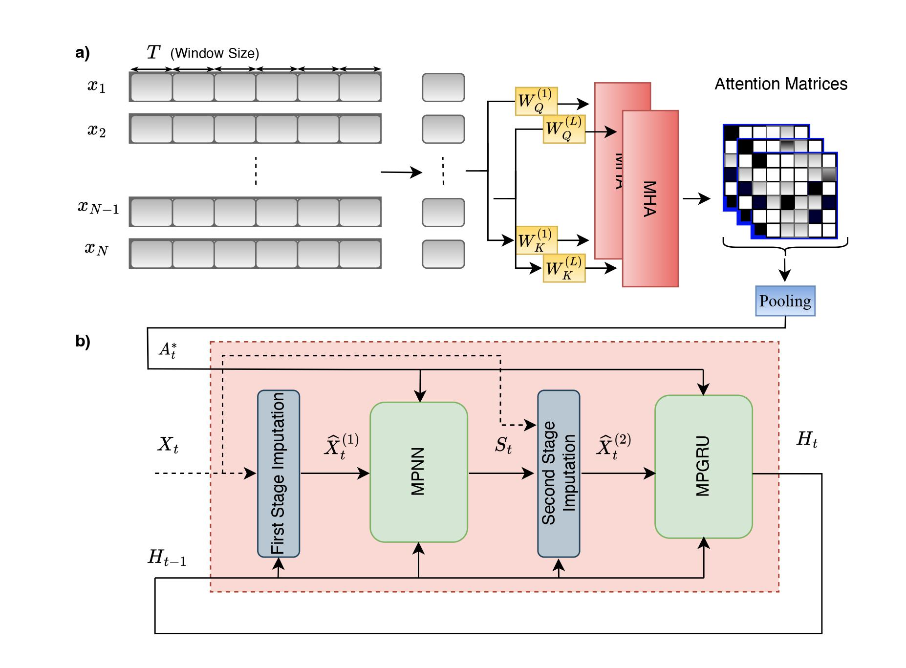

# SDA-GRIN: Spatial Dynamic Aware Graph Recurrent Imputation Network

## Abstract

In various applications, multivariate time series often suffer from missing samples. This issue can significantly disrupt systems that rely on the data for decision-making. Spatial and temporal dependencies can be leveraged to impute the missing samples. Existing imputation methods often ignore dynamic changes in spatial dependencies.

We propose a Spatial Dynamic Aware Graph Recurrent Imputation Network (SDA-GRIN) which is capable of capturing dynamic changes in spatial dependencies. SDA-GRIN leverages a multi-head attention mechanism to adapt graph structures with time. SDA-GRIN models multivariate time series as a sequence of temporal graphs and uses a recurrent message-passing architecture for imputation.

We evaluate SDA-GRIN on four real-world datasets from two domains: SDA-GRIN improves MSE by 9.51% for the AQI and 9.40% for AQI-36. On the PEMS-BAY dataset, it achieves a 1.94% improvement in MSE. Detailed ablation study demonstrates the effect of window sizes and missing data on the performance of the method.

## Overview



## Dataset

The datasets used in this project can be found [here](https://drive.google.com/drive/folders/1ygF8sB19WvZ4v3yfymezGDREZU3dX9ee?usp=share_link). After downloading them, you need to put each dataset in `scripts/datasets/<dataset name>`.

## Checkpoints

Pre-trained model checkpoints are available [here](https://drive.google.com/drive/folders/14pi5_4hvtwqSKmKZP7danKONrrjP4HUd?usp=share_link).


## Training

To train the model on different datasets, use the following commands:

```bash
python ./scripts/main.py --config config/sdagrin/air36_train.yaml
python ./scripts/main.py --config config/sdagrin/air_train.yaml
python ./scripts/main.py --config config/sdagrin/la_train.yaml
python ./scripts/main.py --config config/sdagrin/bay_train.yaml
```

## Evaluation

To evaluate the saved models, use the following commands:

```bash
python ./scripts/main.py --config config/sdagrin/air36_eval.yaml
python ./scripts/main.py --config config/sdagrin/air_eval.yaml
python ./scripts/main.py --config config/sdagrin/bay_eval.yaml
python ./scripts/main.py --config config/sdagrin/la_eval.yaml
```

## Environment Setup

We use `Python 3.8` for all experiments. To install the required packages, you can use `requirements.txt` and `conda_env.yml`.

## Acknowledgements

This project builds upon the work done in the [GRIN repository](https://github.com/Graph-Machine-Learning-Group/grin).

